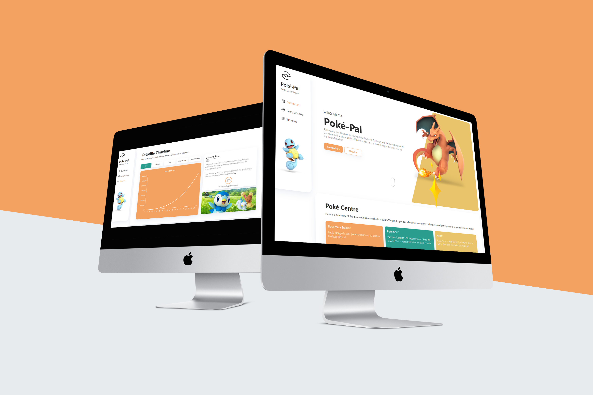

# Pokemon


<!-- Repository Information & Links-->
<br />


<!-- HEADER SECTION -->
<h5 align="center" style="padding:0;margin:0;">Alexa Pettitt</h5>
<h5 align="center" style="padding:0;margin:0;">21100290</h5>
<h6 align="center">DV200 - Term 1 | 2022</h6>
</br>
<p align="center">

  <a href="https://github.com/AlexaPea/Pokemon">
    
  </a>
  
  <h3 align="center">Poke-Pal</h3>

  <p align="center">

  This Pokémon website is a case of data driven design. Through the creation of intelligent algorithms and systems that analyze, sorts and visualize vast data sets in a way that is easier to understand, we will be showcasing comparative Pokémon data and timeline data.
   <br>
    <i> Poke-Pal is a data-driven website, created through the utilization of React, APIs and NodeJs. In order to visualize the API data, Charts.js was used.</i> 
    
   <br />
   <br />
   <a href="path/to/demonstration/video">View Demo</a>
    ·
    <a href="https://github.com/AlexaPea/Pokemon/issues">Report Bug</a>
    ·
    <a href="https://github.com/AlexaPea/Pokemon/issues">Request Feature</a>
</p>
<!-- TABLE OF CONTENTS -->

## Table of Contents

* [About the Project](#about-the-project)
  * [Project Description](#project-description)
  * [Built With](#built-with)
* [Getting Started](#getting-started)
  * [Prerequisites](#prerequisites)
  * [How to install](#how-to-install)
* [Features and Functionality](#features-and-functionality)
* [Concept Process](#concept-process)
   * [Ideation](#ideation)
   * [Wireframes](#wireframes)
   * [Custom UI](#user-flow)
* [Development Process](#development-process)
   * [Implementation Process](#implementation-process)
        * [Highlights](#highlights)
        * [Challenges](#challenges)
   * [Future Implementation](#peer-reviews)
* [Final Outcome](#final-outcome)
    * [Mockups](#mockups)
    * [Video Demonstration](#video-demonstration)
* [Conclusion](#conclusion)
* [License](#license)
* [Contact](#contact)
* [Acknowledgements](#acknowledgements)

<!--PROJECT DESCRIPTION-->
## About the Project
<!-- header image of project -->
![image1][image1]

### Project Description

Poke-Pal, provides all Pokemon trainers with the information they need to become a Pokemon Master. Learn about all the basics regarding the Pokemon world, compare Pokemon strengths and more! 

### Built With

* [React](https://reactjs.org/)
* [Charts.js](https://www.chartjs.org/)
* [PokeApi](https://pokeapi.co/)

<!-- GETTING STARTED -->
<!-- Make sure to add appropriate information about what prerequesite technologies the user would need and also the steps to install your project on their own mashines -->
## Getting Started

The following instructions will get you a copy of the project up and running on your local machine for development and testing purposes.

### Prerequisites

Ensure that you have the latest version of [NPM](https://www.npmjs.com/) installed on your machine. The [GitHub Desktop](https://desktop.github.com/) program will also be required.

### How to install

### Installation
Here are a couple of ways to clone this repo:

1. GitHub Desktop </br>
Enter `https://github.com/AlexaPea/Pokemon.git` into the URL field and press the `Clone` button.

2. Clone Repository </br>
Run the following in the command-line to clone the project:
   ```sh
   git clone https://github.com/AlexaPea/Pokemon.git
   ```
    Open `Software` and select `File | Open...` from the menu. Select cloned directory and press `Open` button

3. Install Dependencies </br>
Run the following in the command-line to install all the required dependencies:
   ```sh
   npm install
   ```

4. An API key is not required


<!-- FEATURES AND FUNCTIONALITY-->
<!-- You can add the links to all of your imagery at the bottom of the file as references -->
## Features and Functionality

<!-- note how you can use your gitHub link. Just make a path to your assets folder -->




### All The PokeApi Data Your Heart Desires! 
Using the PokeApi, we have collected and communicated all relevant Pokemon data into once seemless react experience!

![image4][image4]
### View General Stats!
The home page provides our fellow trainers with API generated content! Here they are able to view the basic knowledge needed to begin their journey!

![image3][image3]
### Compare Any Two Pokemon!
Poke-Pal allows you to select any two Pokemon of your choosing to compare! Here you are able to see each Pokemons statistics, catch rate, and who would win in battle!

![image4][image4]
### View Growth Rates!
The Timeline page provides users the opportunity to view the different Pokemon growth rates through graphs. As you toggle between different rate, relevent information will be provided!


![image5][image5]


<!-- CONCEPT PROCESS -->
<!-- Briefly explain your concept ideation process -->
<!-- here you will add things like wireframing, data structure planning, anything that shows your process. You need to include images-->
## Concept Process

The `Conceptual Process` is the set of actions, activities and research that was done when starting this project.

### Ideation
In order to begin my website ideation process, I first needed to choose an API. I chose to make use of PokeApi.


![image5][image5]
<br>
![image6][image6]

### Wireframes
Once I had a clear concept for the website I wanted to achieve, I began creating wireframes.

![image7][image7]

### Custom UI
I then gained UI and branding inspiration using Pinterest, Behance and Dribble. I found myself gravitating to clean, simplistic yet playful designs which I felt would compliment my API data and create a memorable branding for the website.


![image8][image8]

<!-- DEVELOPMENT PROCESS -->
## Development Process

The `Development Process` is the technical implementations and functionality done in the frontend and backend of the application.

I began the Development process by choosing an API, and ultimately decided on the PokeAPI. This API data would dynamically populate my websites content. Once I completed my ideation for my website. I continued to the website creation.

React, a javascript library, was utilized in the creation of my project. Allowing the creation of the numerous components required in my project. This allowed for the practice of object-orientated programming.

I then installed the necesarry libraries and plugins required for the website, this included Charts.js which would be utilized to visually communiate my API data, through dynamically populated charts.


### Implementation Process
<!-- stipulate all of the functionality you included in the project -->
<!-- This is your time to shine, explain the technical nuances of your project, how did you achieve the final outcome!-->

* Utilized React `Charts.JS` dependency for Data visualization
* Implemented Routing with `React-Router v6`.
* API End Point: https://pokeapi.co/ 


#### Highlights
<!-- stipulated the highlight you experienced with the project -->
* Through this project I gained more skills which have aided me in my growth as a developer. 
* I learnt new libraries, such as react and charts.js, which have encouraged me to push myself to learn even more libraries and plugins that could enhance my capabilities as a full stack developer.
* I also found that creating a website based on content I am interested in has made me feel more motivated and encouraged to pursue development further.

#### Challenges
<!-- stipulated the challenges you faced with the project and why you think you faced it or how you think you'll solve it (if not solved) -->
* I struggled with adjusting to React and the numerous hooks.
* I found that I faced many challenges with the assynchronous API calls, often struggling with retrieving the data successfully.
* Using props across components was a challenge in certain cirumstances as props would read as undefined.

* However, through numerous trials and errors, i was able to overcome these issues.


#### Above And Beyond

What aspects of this final build contribute to the `Above And Beyond` Component of your brief?
<!-- what did you learn outside of the classroom and implement into your project-->
* I learnt how to change the button colours when active through the use of functions and function calls I had previously been unaware of.
* I further studied the Chart.js documentation in order to style my graphs more proffessionaly.
* I learnt how to created onClick functions in react.
* I did further research on react-router-dom in  order to implement more components from that library i.e NavLinks


### Future Implementation
<!-- stipulate functionality and improvements that can be implemented in the future. -->

* In future I would like to add more graphs and contextualise these graphs to a greater degree.
* I would like to add additional pages to enhance my website and its contents,such as a trainer card page.
* I would like to add more content to the "winner" block on my comparisons page.

<!-- MOCKUPS -->
## Final Outcome

### Mockups

![image9][image9]
<br>
![image10][image10]

<!-- VIDEO DEMONSTRATION -->
### Video Demonstration

To see a run through of the application, click below:

[View Demonstration](path/to/video/demonstration)


See the [open issues](https://github.com/AlexaPea/Pokemon/issues) for a list of proposed features (and known issues).

<!-- AUTHORS -->
## Authors

* **Alexa Pettitt** - [AlexaPea](https://github.com/AlexaPea)

<!-- LICENSE -->
## License

Distributed under the MIT License. See `LICENSE` for more information.\

<!-- LICENSE -->
## Contact

* **Alexa Pettitt** - [21100290@virtualwindow.co.za](mailto:21100290@virtualwindow.co.za) - [@instagram_handle](https://www.instagram.com/instagram_handle/) 
* **Project Link** - https://github.com/AlexaPea/Pokemon

<!-- ACKNOWLEDGEMENTS -->
## Acknowledgements
<!-- all resources that you used and Acknowledgements here -->
<!-- * [Resource Name](path/to/resource)
* [Resource Name](path/to/resource)
* [Resource Name](path/to/resource)
* [Resource Name](path/to/resource)
* [Resource Name](path/to/resource) -->